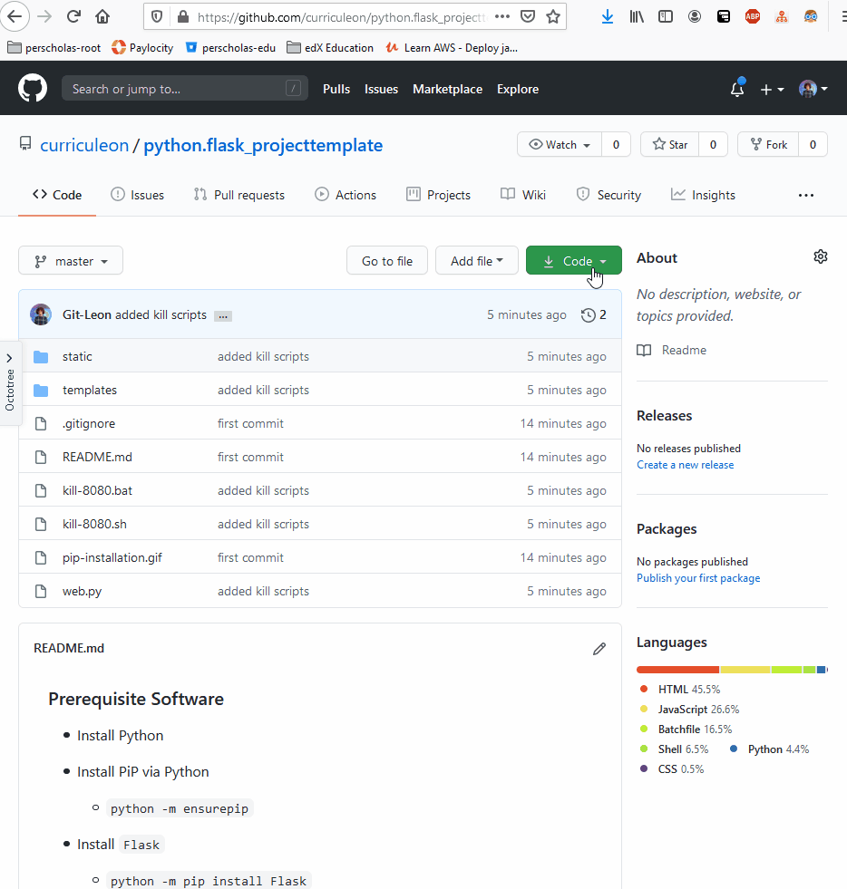

### Prerequisite Software
* Install Python
* Install PiP via Python
    * `python -m ensurepip`

* Install `Flask`
    * `python -m pip install Flask`

### How to run this
* Upon executing `python app.py`, navigate to `localhost:8080` to view the webpage.

